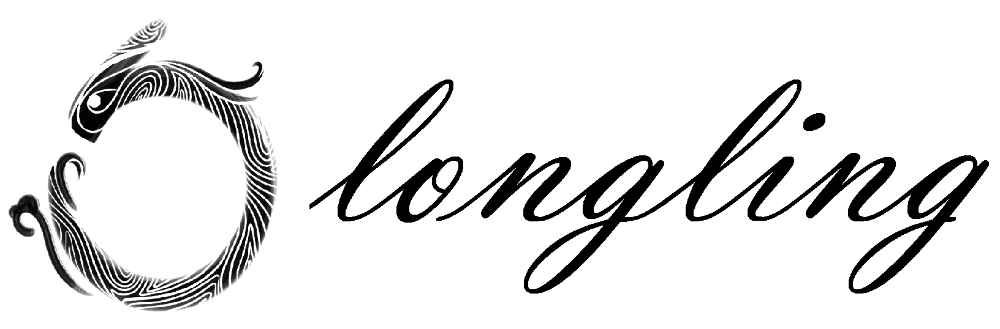

# longling

[](https://pypi.python.org/pypi/longling)
[](https://pypi.python.org/pypi/longling)
[](https://github.com/tswsxk/longling/actions/workflows/python-test.yml)
[](https://codecov.io/gh/tswsxk/longling)
[](https://longling.readthedocs.io/zh/latest/index.html)
[](https://pypi.python.org/pypi/longling)
[](LICENSE)


This project aims to provide some handy toolkit functions to help construct the
architecture. 
Full documentation [here](https://longling.readthedocs.io/zh/latest/index.html).

## Installation

### pip

```shell
pip install longling
```

### source
clone the repository and then run `pip install .`:

```shell
git clone https://github.com/tswsxk/longling.git
cd longling
pip install .
```

### Notation
Due to the possible multi version of deep learning frameworks like 
mxnet(for cpu) and mxnet-cu90(for gpu, with cuda version 9.0), 
it is good to install such frameworks in advance. 
For swift installation, use `--no-dependencies` option as follows:

```shell
# pip
pip install longling --no-dependencies
# source
python setup.py install --no-dependencies
```

### Help for windows user

Due to the potential compile error in windows, some required package may not be installed as expected.
To deal with this issue, pre-compiled binaries are advised.
You can go to [lfd.uci.edu/~gohlke/pythonlibs](https://www.lfd.uci.edu/~gohlke/pythonlibs) 
and download the required packages.

